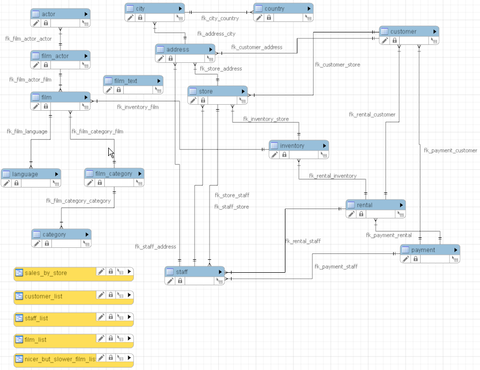

<a href="https://www.linkedin.com/in/enzodelcompare">
  
</a>

# <a href="https://dev.mysql.com/doc/sakila/en/">Banco de Dados Sakila</a>

O banco de dados **Sakila** foi inicialmente desenvolvido por [Mike Hillyer](https://github.com/MHillyer), um ex-membro da equipe de documentação do **MySQL AB**. Ele foi criado com a intenção de fornecer um esquema padrão que possa ser usado como exemplo em livros, tutoriais, artigos, amostras e assim por diante. O banco de dados de exemplo **Sakila** também serve para destacar recursos do **MySQL**, como **Views**, **Stored Procedures** e **Triggers**.

Informações adicionais sobre o banco de dados **Sakila** e seu uso podem ser encontradas nos [fóruns](https://forums.mysql.com/) do **MySQL**.

O banco de dados de exemplo **Sakila** é o resultado do apoio e feedback da comunidade de usuários do **MySQL** e o feedback e sugestões dos usuários são sempre bem-vindos. Por favor, envie todo o feedback utilizando este [link](http://www.mysql.com/company/contact/). Para relatórios de bugs, use [MySQL Bugs](https://bugs.mysql.com/).

## Estrutura

O diagrama a seguir fornece uma visão geral da estrutura do banco de dados de exemplo **Sakila**. O arquivo de origem do diagrama (para uso com o [MySQL Workbench](https://www.mysql.com/products/workbench/)) está incluído na distribuição do **Sakila** e é nomeado como **sakila.mwb**.



**Tabelas:** ```actor```, ```address```, ```category```, ```city```, ```country```, ```customer```, ```film```, ```film_actor```, ```film_category```, ```film_text```, ```inventory```, ```language```, ```payment```, ```rental```, ```staff``` e ```store```

<br>

> NOTA: Para mais informações detalhadas sobre as tabelas, suas colunas e relacionamentos, acesse [+ Sakila](https://github.com/enzodelcompare/treinamento-sql/blob/main/sakila.md)

<br>

## Docker

Para acessar via Docker o banco de dados [Sakila](https://github.com/sakiladb/mysql)

<br>

## Lista de Exercícios

Para acessar os exercícios, clique [aqui!](https://github.com/enzodelcompare/treinamento-sql/blob/main/exercicios/exercicios.sql)
